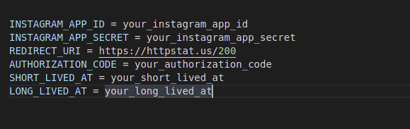

Finalized version of consuming the Instagram basic display API on a Node.js GraphQL API.

- Ensure that you have a `.env` file in the root of your project with the following structure:

  

- Install the dependencies:

  ```bash
  npm install
  ```

- Start the development server:

  ```bash
  npm run dev
  ```

- Consume the GraphQL API from [here](http://localhost:4000/graphql).
